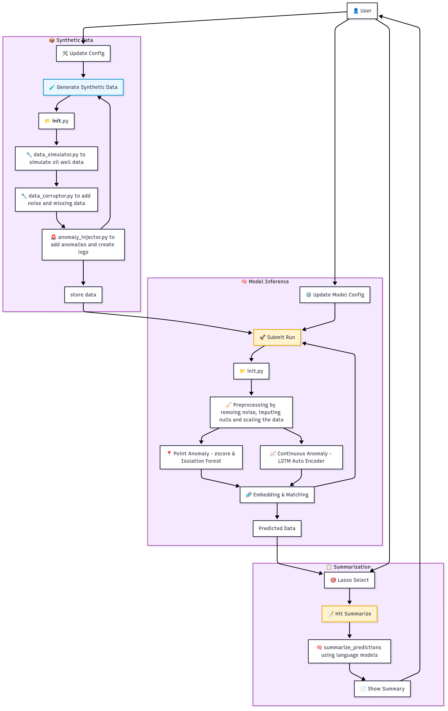

## Project Pipeline

    

## 📌 Key Design Decisions

1. **Physics-Informed Synthetic Data Simulation**  
   Simulated real-world oilfield behaviors including:
   - **Shut-in periods** to mimic well closures
   - **Pressure decline curves** using exponential decay
   - **Flow rate degradation** reflecting natural production losses

2. **Domain-Aligned Anomaly Injection**  
   - Injected realistic failure modes like **choke erosion**, **liquid loading**, and **sand production**
   - Associated logs imitate field engineer language for semantic grounding

3. **Lightweight & Deployable Modeling Stack**  
   - **LSTM Autoencoder** (3 layers, 64 units) for sequence anomaly detection  
   - **Isolation Forest & Z-score** for statistical outlier detection  
   - **`flan-t5-small`** for summarization: low-latency and easy to deploy

---

## ⚖️ Trade-offs & Opportunities for Improvement

1. **No Explicit Metrics for Detection**  
   - Unsupervised setup limits ability to compute accuracy, precision, etc.

2. **Single Well Simulation Only**  
   - Doesn’t capture the variability or volume of multi-well operations

3. **Natually Flowing Wells Only**
   - Doesn't capture the behaviors of a Artifically (Plunger / Gas) Lifted wells

4. **Static Thresholding**  
   - Manual anomaly thresholds can struggle with dynamic signal ranges

5. **Limited Log Granularity**  
   - Only 1 log per anomaly: misses time-evolving observations from field ops

6. **LLM Scale Limitations**  
   - `flan-t5-small` may not generalize to complex logs or richer inputs

7. **Synthetic–Real Gap**  
   - Simulated data may not replicate all edge cases and variability of actual oilfield telemetry

8. **Detection Without Classification**  
   - Model detects anomalies but doesn’t label them for evaluation or downstream usage
   
9. **Limited Attribute Diversity**  
    - The current dataset is focused on a small set of pressure and flow metrics. Missing attributes like **Casing Pressure**, **Oil/Gas/Water Rate**, **Choke Size**, **Downhole Pressure**, and **Well State** (e.g., Natural Flow, Gas Lift, Plunger Lift) limits the realism and complexity of detected behavior patterns.

---

## ⚠️ Known Failure Points

1. **Scalability Concerns**  
   - Single model may not generalize across multiple wells or large-scale streaming data

2. **Modal Conflicts**  
   - Simultaneous multi-sensor anomalies may confuse embedding matching

3. **Summarization Drift**  
   - Low-quality logs or repeated language may degrade generated output

4. **Embedding Misalignment**  
   - Drift between predicted and labeled embeddings may affect similarity scores

5. **Synthetic–Real Transfer Gap**  
   - Behavior and summaries trained on synthetic inputs may not map well to field data

---

## 🚀 Future Work

1. **Multi-Well Simulation**  
   - Vary operating conditions and anomaly types across wells for richer validation

2. **Evaluation Pipeline**  
   - Use LLM-labeled anomalies to compute accuracy, precision, recall

3. **Model Upgrades**  
   - Swap in larger models like `flan-t5-large`, `mistral`, or `mixtral` for deeper summarization

4. **Fusion-Based Prediction**  
   - Combine logs and sensor inputs at inference instead of post-processing

5. **Progressive Log Injection**  
   - Simulate more realistic operations by injecting logs throughout an anomaly lifecycle

6. **Model Registry**  
   - Track model versions, training data, and configuration snapshots

7. **Cloud Deployment & Scheduling**  
   - Run periodic simulations and detection jobs using tools like Airflow or Azure ML

8. **Expand Feature Set with Production & Downhole Attributes**  
   - Introduce additional telemetry streams such as:
     - **Casing Pressure**
     - **Oil, Gas, and Water Rates**
     - **Choke Size**
     - **Downhole Pressure & Temperature**
     - **Well Lift Method** (e.g., Natural, Gas Lift, Plunger)
   - These variables will allow more detailed simulations, improved anomaly differentiation, and broader applicability to real-world production surveillance.