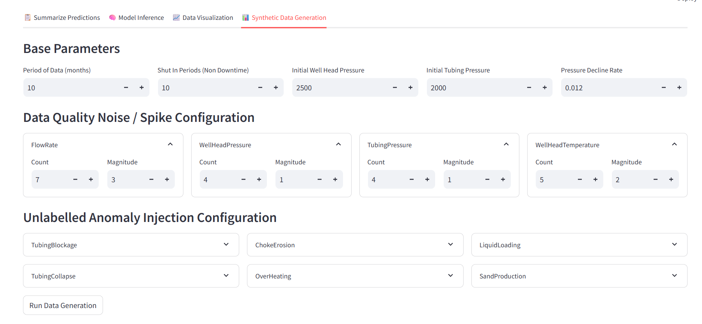
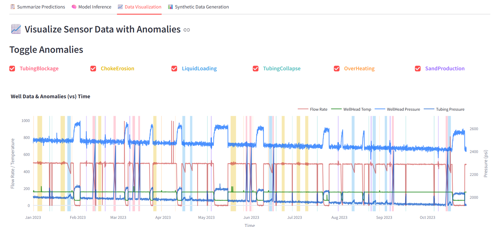
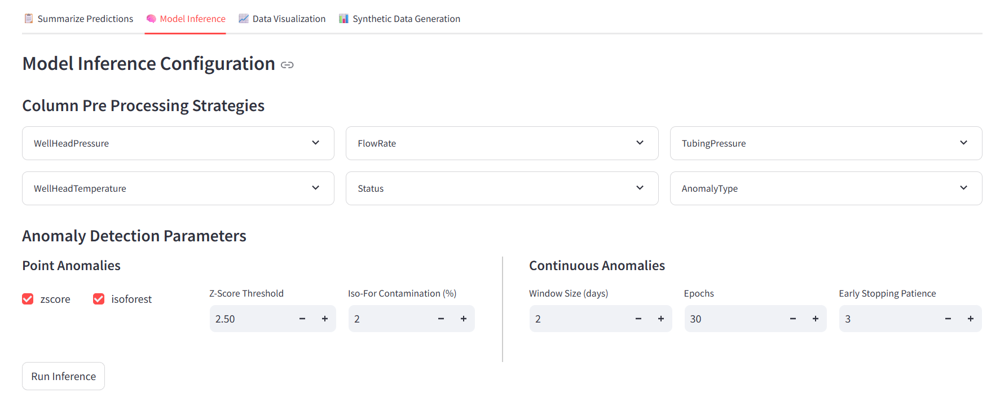
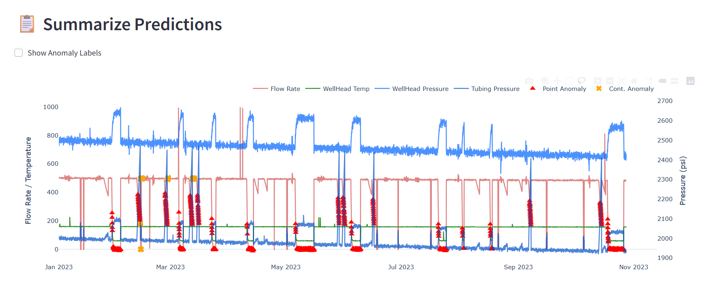
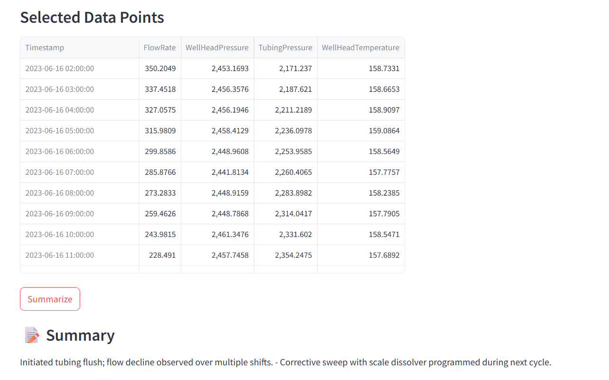

# 🛢️ Oil and Gas Well Anomaly Detection System

This project offers a full-stack simulation and anomaly detection suite for oil and gas wells. It integrates **synthetic data generation**, **ML-based anomaly detection**, **embedding-based log matching**, and **LLM-powered summarization**—all accessible through a clean Streamlit UI.

---

## 📚 Table of Contents

- [Oil and Gas Well Anomaly Detection System](#️-oil-and-gas-well-anomaly-detection-system)
- [Features](#-features)
- [Folder Structure](#-folder-structure)
- [Setup](#-setup-instructions)
  - [Code Setup](#code-setup)
  - [Ollama Setup (Llama3.1 for Local LLM)](#-ollama-setup-llama31-for-local-llm)
- [Running the App](#-running-the-app)
  - [Without Docker](#without-docker)
  - [With Docker](#with-docker)
- [Solution Workflow](#-solution-workflow)
  - [Synthetic Data Generation](#-synthetic-data-generation)
    - [Data Preparation Logic](#️-synthetic-data-preparation-logic)
    - [Data Corruption Logic](#-data-corruption-logic)
    - [Anomaly Injection Logic](#-anomaly-injection-logic)
      - [Anomaly Types](#-anomaly-types)
    - [Maintenance Log Embedding & Summarization](#-maintenance-log-embedding--summarization)
  - [Data Visualization](#-data-visualization)
  - [Model Inference](#-model-inference)
    - [Model Inference Logic](#-model-inference-workflow)
      - [Pre Processing](#-step-1-preprocessing)
      - [Point Anomaly Detector](#-step-2-point-anomaly-detection)
      - [Continuous Anomaly Detector](#-step-3-continuous-anomaly-detection)
      - [Embedding Anomalies](#-step-4-embedding-anomaly-snapshots)
      - [Nearest Neighbor Matching](#-step-5-nearest-neighbor-matching)
  - [Summarize Predictions](#-summarize-predictions)
    - [Summarization Logic](#-summarization-logic-llm-powered)
- [LLM Example](#-llm-summarization-example)
- [License](#-license)
---

## 🚀 Features

- 🧪 **Synthetic Data Generator**  
Simulates realistic time-series data (flow rate, WHP, WHT, tubing pressure) with shut-in logic and operational decline curves.

- 🧨 **Noise & Fault Injector**  
Adds missing values, random noise spikes, and six types of engineered anomalies (e.g., Tubing Blockage, Sand Production).

- 🧠 **Anomaly Detection**  
- *Point Anomalies*: Z-Score and Isolation Forest
- *Continuous Anomalies*: LSTM Autoencoder

- 🔁 **Embedding & Similarity Matching**  
Matches detected anomalies against embedded engineer maintenance logs using **cosine similarity**.

- 📜 **LLM-Based Anomaly Summarization**  
Text summaries of anomalous episodes using `llama3.1` quantized model using ollama with dynamically constructed prompts.

- 📊 **Visual Analytics Dashboard (Streamlit)**  
Multi-tabbed layout for simulation, visualization, inference, and summary reporting.

---

## 📁 Folder Structure

```text
|- app.py                         # Streamlit UI logic & workflow
|- utils.py                      # Visualization helpers (Plotly plots & anomaly overlays)
|- data_simulator/
|  |- __init__.py                # Orchestrates the simulation → corruption → logging pipeline
|  |- data_simulator.py          # Simulates well behavior (downtime, pressure decay, etc.)
|  |- data_corruptor.py          # Adds missing values and synthetic spike noise
|  |- anomaly_injector.py        # Injects 6 anomaly types and logs based on templates
|  |- generate_logs.py           # Engineer-like logs (natural language templates + style randomization)
|- anomaly_detection/
|  |- __init__.py                # Inference controller (preprocessing → modeling → embedding)
|  |- data_preparation.py        # Per-feature imputing, denoising, scaling
|  |- point_modeller.py          # Z-score and Isolation Forest logic
|  |- continuous_modeller.py     # LSTM Autoencoder model and trainer
|  |- embed.py                   # Embedding extractor & cosine similarity matcher
|- summarizer/
|  |- __init__.py                # LLM-based summarizer using ollama quantized llama3.1 model
|- requirements.txt              # Python dependencies
```

---

## 🧰 Setup Instructions

### Code setup
```bash
# Clone the repository
git clone https://github.com/vishnu-palagiri/OilRigAnomalyDetection
```

### 🔧 Ollama Setup (Llama3.1 for Local LLM)

#### 1. Install Ollama

Download and install Ollama from the official website: [Download ollama](https://ollama.com/download)

---

## 🧪 Running the App

### Preview the App

The app is deployed at [🚀OilRigAnomalyDetection](https://oilriganomalydetection.streamlit.app/). You can preview the app here. 

_Note: Everything except the summarization of anomalies would work in this depoloyment, since Ollama model won't be run at Streamlit's server_

### Without Docker

Before running the app, pull llama3.1 model & start the local model server:
```bash
ollama run llama3.1

ollama serve
```

This will launch Ollama's REST API at http://localhost:11434, which the streamlit app can access to generate responses from the Llama3.1 model.

Install required packages and run the streamlit app in terminal
```bash
# Install required packages
pip install -r requirements.txt

streamlit run app.py
```

This will lauch the streamlit app at http://localhost:8501

### With Docker

Build the container image (Only first time)
```bash
docker-compose --build
```

Run the containers
```bash
docker-compose up ollama-server
docker-compose up streamlit-app
```
This will lauch the streamlit app at http://localhost:8501 & ollama model at http://localhost:11434

Stop all containers
```bash
docker-compose down
```

## 🧩 Solution Workflow
### 📊 Synthetic Data Generation  
Used to generate synthetic data with a wide range of configuration parameters.

<details>
<summary>⚙️ <strong>Base Parameters</strong></summary>

| Parameter                   | Description                                         |
|----------------------------|-----------------------------------------------------|
| Period of Data             | Number of months of data to be generated            |
| Shut In Periods            | Total number of shut-in periods for the well        |
| Initial Well Head Pressure | The initial pressure at the well head               |
| Initial Tubing Pressure    | The initial pressure at the tubing                  |
| Pressure Decline Rate      | Rate at which pressure declines at the well head    |

</details>

<details>
<summary>🧪 <strong>Data Quality Config Parameters</strong></summary>

| Parameter | Description                                                                 |
|-----------|-----------------------------------------------------------------------------|
| Count     | Number of erroneous behaviors in the selected stream                       |
| Magnitude | Magnitude of erroneous behaviors (in standard deviations)                  |

</details>

<details>
<summary>🚨 <strong>Anomaly Injection Config Parameters</strong></summary>

| Parameter                  | Description                                                         |
|---------------------------|---------------------------------------------------------------------|
| Count of Logged Events    | Total number of anomaly events with associated engineer logs        |
| Count of Non Logged Events| Total number of anomaly events without associated engineer logs     |
| Min Duration              | Minimum duration of an anomaly event                                |
| Max Duration              | Maximum duration of an anomaly event                                |

</details>

<p align="center">

</p>

---

#### 🛠️ Synthetic Data Preparation Logic

1. **Shut-In Events**  
  - Random shut-in periods are generated based on the configured count.

2. **Pressure Calculation**  
  - Well Head and Tubing pressures are computed using the initial values and decline rates.
  - Calculated as: 
    `Initial Pressure - decline rate * factor`

3. **Flow Rate Simulation**  
  - Calculated as:  
    `500 (base flow rate) - (well head pressure decline * 0.2)`  
  - This models real-world productivity decay.

4. **Temperature Simulation**  
  - Computed as:  
    `60 (base temp) + 0.2 * flowrate + random value between 0 to 0.5`

5. **Shut-In Adjustments**  
  When the well is shut in:
  - **Rise Factor**:  
    `1 - exp(- shut-in duration (in hours))`  
    Used to gradually **increase pressure** over time.
  - **Flow Decay Factor**:  
    `exp(-2 * shut-in duration (in hours))`  
    Used to gradually **decrease flow rate**.

  Applied Modifications:
  - Well Head Pressure: `+ 150 * rise factor + random(0, 3)`
  - Tubing Pressure: `+ 100 * rise factor + random(0, 2)`
  - Flow Rate: `* decay factor + random(0, 2)`

🔍 Code: [data_simulator/__init__.py](https://github.com/vishnu-palagiri/OilRigAnomalyDetection/blob/main/data_simulator/__init__.py).

#### 🧮 Data Corruption Logic

1. **Missing Value Insertion**  
  - Drops random records based on a configurable **missing rate** (default: `1%`).

2. **Data Spike Insertion**  
  - Randomly selects records and applies spikes:  
    `± (magnitude × standard deviation)`

Corruption is applied per stream (e.g., FlowRate, Pressure, Temperature) to emulate sensor errors.

🔍 Code: [data_corruptor.py](https://github.com/vishnu-palagiri/OilRigAnomalyDetection/blob/main/data_simulator/data_corruptor.py)

#### 🧮 Anomaly Injection Logic

To simulate realistic operational disruptions, the pipeline injects both point and continuous anomalies into the synthetic dataset:

1. **Point Anomalies**  
  - Sudden, short-lived deviations in sensor readings (e.g., pressure spikes or drops).

2. **Continuous Anomalies**  
  - Gradual or sustained deviations over a time window (e.g., overheating, tubing collapse).

3. **Log Association**  
  - Some anomalies are paired with synthetic engineer logs to simulate real-world diagnostics.
  - These logs are later used for semantic summarization in the prediction tab.

##### 🔍 Anomaly Types

| Type             | Description                               | Category     |
|------------------|-------------------------------------------|--------------|
| TubingBlockage   | Restriction causing flow drop & TP rise   | Gradual      |
| ChokeErosion     | Surging flow rate due to orifice wear     | Gradual      |
| LiquidLoading    | Hydrostatic loading, flow collapse        | Gradual      |
| TubingCollapse   | Sudden shutdown, TP spike                 | Point        |
| OverHeating      | Localized temp spikes near ESP            | Point        |
| SandProduction   | Abrupt pressure/flow noise from solids    | Point        |

🔍 Code: [data_simulator/anomaly_injector.py](https://github.com/vishnu-palagiri/OilRigAnomalyDetection/blob/main/data_simulator/anomaly_injector.py)

#### 🧮 Maintenance Log Embedding & Summarization

As the final step in the synthetic data pipeline, the system embeds and summarizes maintenance logs using a transformer-based language model.

1. **Log Embedding**  
  - Each engineer log is embedded using a pretrained transformer model (e.g., `sentence-transformers/all-MiniLM-L6-v2`).
  - Embeddings are used to compute **semantic similarity** between logs and selected anomalies.

🔍 Code: [data_simulator/__init__.py](https://github.com/vishnu-palagiri/OilRigAnomalyDetection/blob/main/data_simulator/__init__.py).

---

### 📈 Data Visualization

Visualize the **synthetic time series data** to observe trends, identify signal behaviors, and analyze induced anomalies across the simulation period.

Each anomaly type comes with its own toggle, allowing fine-grained control over the visualization:

- ✅ **Anomaly Toggles**: Enable or disable background highlights (rectangular overlays) for each anomaly type individually.
- 🕒 **Time Axis Exploration**: Inspect how different sensor signals change over the data generation window.
- 🎯 **Anomaly Context**: Highlighted periods correspond to time spans where anomalies were synthetically injected, aiding correlation and interpretability.

<p align="center">

</p>

---

### 🧠 Model Inference
Model inference configuration allows you to fine-tune preprocessing steps and anomaly detection behavior for both point-wise and continuous anomaly detection models.

<details>
<summary>🧹 <strong>Column Pre-processing Strategies</strong></summary>

| Parameter | Description                                                                 |
|-----------|-----------------------------------------------------------------------------|
| Impute    | Imputation method – options include `ffill`, `interpolate`, or `none`      |
| Denoise   | Whether to apply noise filtering to the selected attribute                 |
| Scale     | Whether to scale the selected attribute before inference                   |

</details>

<details>
<summary>📍 <strong>Point Anomaly Detection</strong></summary>

| Parameter                | Description                                                                 |
|-------------------------|-----------------------------------------------------------------------------|
| zscore                  | Enable/disable z-score anomaly detection                                     |
| isoforest               | Enable/disable Isolation Forest algorithm                                    |
| zscore threshold        | Z-score threshold for anomaly flagging (in standard deviations)              |
| IsoFor Contamination %  | Contamination parameter for Isolation Forest (i.e., expected anomaly fraction) |

</details>

<details>
<summary>📈 <strong>Continuous Anomaly Detection</strong></summary>

| Parameter                 | Description                                                              |
|--------------------------|--------------------------------------------------------------------------|
| window size (days)       | Size of the rolling window for LSTM AutoEncoder                          |
| epochs                   | Number of training epochs to run                                         |
| early stopping patience  | Number of epochs to wait without improvement before stopping training    |

</details>

<p align="center">

</p>
---

#### 🧩 Model Inference Workflow

The model inference pipeline is structured into five sequential steps that transform raw sensor data into interpretable anomaly predictions with semantic links to known failure modes.

##### 🧹 Step 1: Preprocessing
Raw sensor data is first standardized to ensure stability and consistency across downstream models.

- **Imputation**: Handles missing values using `ffill`, `interpolate`, or leaves them as-is.
- **Denoising**: A rolling median filter is applied to smooth out sharp noise while preserving signal structure. Points that deviate beyond `threshold × MAD (Mean Abs Deviation)` from the local median are replaced, reducing transient spikes.
- **Scaling**: Normalizes feature ranges for algorithms sensitive to variance to identify anomalies.

🔍 Code: [Data Preparation](https://github.com/vishnu-palagiri/OilRigAnomalyDetection/blob/main/anomaly_detection/data_preparation.py)


##### 📍 Step 2: Point Anomaly Detection
Detects short-lived, spike-like deviations using fast statistical and ensemble-based methods.

- **Z-score Algorithm**: Flags outliers exceeding a configurable standard deviation threshold.
- **Isolation Forest**: Detects anomalous data points using data partitioning, influenced by a contamination hyperparameter.

🔍 Code: [Point Modeller](https://github.com/vishnu-palagiri/OilRigAnomalyDetection/blob/main/anomaly_detection/point_modeller.py)


##### 📈 Step 3: Continuous Anomaly Detection
Identifies prolonged deviations using an LSTM-based autoencoder.

- Trained on normal sequences to learn reconstruction patterns.
- Sequences with high reconstruction error are labeled as anomalous.
- Highly configurable: window size, epochs, early stopping, and batch size.

🔍 Code: [Continuous Modeller](https://github.com/vishnu-palagiri/OilRigAnomalyDetection/blob/main/anomaly_detection/continuous_modeller.py)


##### 🧬 Step 4: Embedding Anomaly Snapshots
Transforms both predicted anomalies and labeled (ground-truth) anomalies into dense vector embeddings using a transformer model.

- Embeddings capture temporal patterns and semantic behavior of anomalies.
- Enables contextual comparison between predicted vs. known signatures.

🔍 Code: [Embeds](https://github.com/vishnu-palagiri/OilRigAnomalyDetection/blob/main/anomaly_detection/embed.py)


##### 🧠 Step 5: Nearest Neighbor Matching
Links predictions to likely root causes by comparing embeddings.

- Uses **cosine similarity** to find the closest labeled anomaly for every predicted anomaly.
- Facilitates interpretability by surfacing the most semantically aligned known failure mode.

🔍 Code: [Embeds](https://github.com/vishnu-palagiri/OilRigAnomalyDetection/blob/main/anomaly_detection/embed.py)

---

### 📋 Summarize Predictions 

Explore model predictions overlaid on sensor data in a time series view.

- 🖍️ **Lasso Selection**: Use lasso select to highlight regions of interest within the time series.
- 📄 **Dynamic Data Table**: Once a region is selected, a table populates with the corresponding anomalies detected in that window.
- 🧠 **Summarization Trigger**: Click **Summarize** to initiate a summary generation using the `llama3.1` language model.
- 🔎 **Semantic Log Extraction**: Relevant logs are semantically ranked based on anomaly context and summarized accordingly.
- 📌 **Summary Output**: Generated summaries are displayed at the bottom of the tab for easy review and analysis.

<p align="center">


</p>

#### 🧠 Summarization Logic (LLM-Powered)

The final step in the workflow generates human-readable summaries of selected anomaly windows using a transformer-based language model.

1. **Input Preparation**  
  - Extracts and flattens relevant fields: `SimilarAnomalyTypes`, `SimilarMaintenanceNotes`, and `SimilarObservations`.
  - Deduplicates and formats them into a structured prompt.

2. **Prompt Engineering**  
  - Constructs a prompt that guides the model to produce a one-line summary and a short explanation.

3. **Summarization**  
  - Uses `llama3.1` quantized via ollama `(which runs locally)` to generate concise, context-aware summaries.

🔍 Code: [`summarize_predictions()`](https://github.com/vishnu-palagiri/OilRigAnomalyDetection/blob/main/data_simulator/__init__.py)


---

## 🧠 LLM Summarization Example

Uses `llama3.1` to generate concise insights like:

> “Flow rate dropped gradually with rising tubing pressure. Signs suggest a tubing blockage potentially due to wax deposition.”

Prompt templates include anomaly types, observation phrases, and maintenance notes matched via cosine similarity.

---

## 📋 License

MIT License © 2025 Vishnu Palagiri